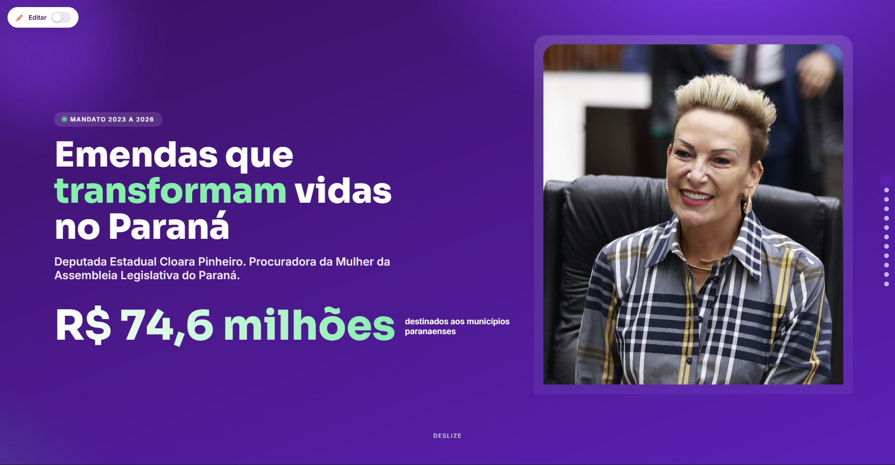
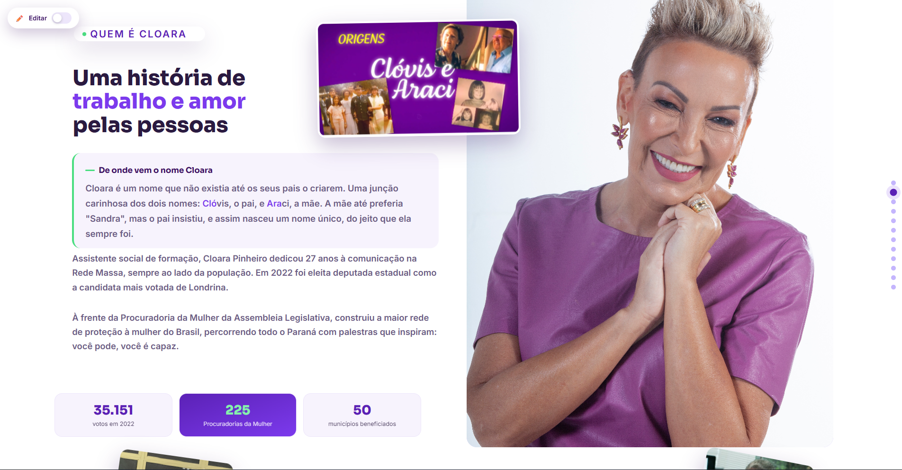
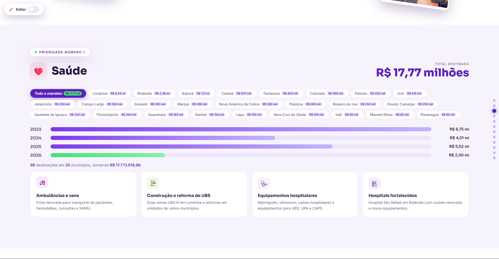
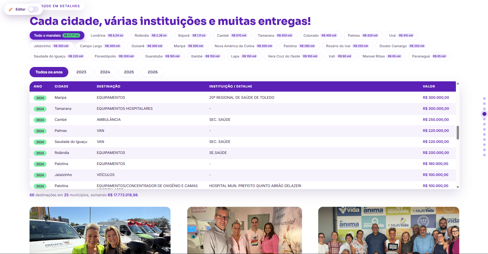
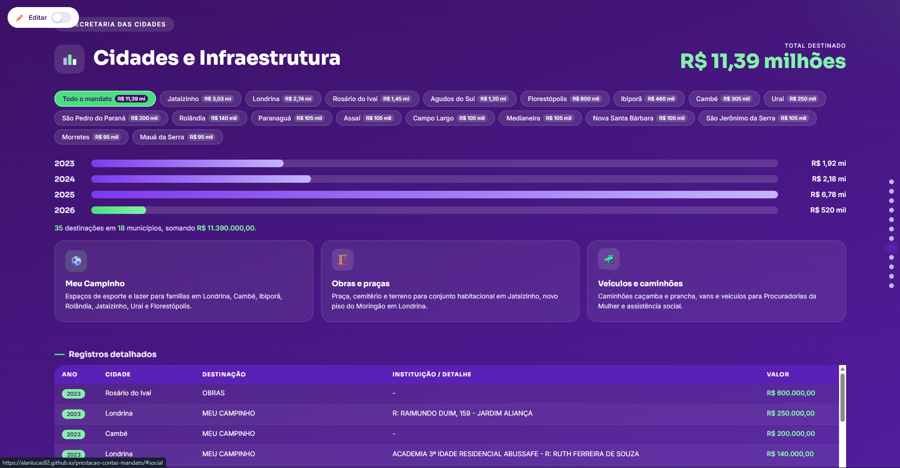

# Prestação de Contas do Mandato 2023-2026
## Parliamentary Accountability Report 2023-2026

## 📸 Preview

### Página inicial


### Quem é Cloara


### Saúde — resumo por região


### Saúde — registros detalhados


### Cidades e Infraestrutura


### Galeria — mais de R$74 milhões transformados em vida real


[](https://github.com)
[](LICENSE)
[](https://html5.org)
[](https://www.w3.org/Style/CSS/)
[](#)

---

## 📋 Índice | Table of Contents

- [Português](#-descrição-pt-br)
- [English](#-description-en-us)

---

## 🎯 Descrição (PT-BR)

Website interativo e responsivo de prestação de contas do mandato parlamentar da Deputada Cloara Pinheiro, exibindo emendas destinadas no período de 2023-2026 no Estado do Paraná.

### ✨ Destaques

- **Design Moderno**: Interface minimalista com paleta de cores roxo, lilás e verde
- **100% Responsivo**: Funciona perfeitamente em mobile, tablet e desktop
- **Animações Suaves**: Transições CSS elegantes que não prejudicam a performance
- **Navegação Intuitiva**: Navigation dots laterais + scroll suave
- **Acessibilidade**: Semântica HTML correta, contraste adequado
- **Código Limpo**: HTML e CSS separados, bem comentados e estruturados

### 🎨 Estrutura Visual

```
┌─────────────────────────────────────┐
│         SEÇÃO HERO                  │
│    (Título + Valor Principal)       │
├─────────────────────────────────────┤
│         SEÇÃO SOBRE                 │
│    (Informações + Estatísticas)     │
├─────────────────────────────────────┤
│    SEÇÕES DE TEMAS (9 áreas)        │
│  - Saúde    - Educação - Esporte    │
│  - Social   - Infraestrutura        │
│  - Segurança - Agropecuária - Etc   │
└─────────────────────────────────────┘
```

### 🛠️ Tecnologias Utilizadas

| Tecnologia | Versão | Descrição |
|-----------|--------|-----------|
| HTML5 | - | Estrutura semântica |
| CSS3 | - | Design, animações e responsividade |
| JavaScript | Vanilla | Navegação e interatividade |
| Google Fonts | - | Fontes: Sora (títulos) e Inter (corpo) |

### 📁 Estrutura de Arquivos

```
prestacao-contas-mandato/
├── index.html              # Arquivo principal
├── styles.css              # Estilos (separado do HTML)
├── README.md               # Este arquivo
├── .gitignore              # Configuração Git
├── LICENSE                 # Licença MIT
└── assets/
    └── imagens/
        ├── cloara-capa.jpg     # Foto de capa (hero section)
        └── cloara-sobre.jpg    # Foto seção sobre
```

### 🚀 Como Usar

#### 1️⃣ Clonar o repositório
```bash
git clone https://github.com/seu-usuario/prestacao-contas-mandato.git
cd prestacao-contas-mandato
```

#### 2️⃣ Abrir no navegador
```bash
# Opção 1: Abrir direto
open index.html

# Opção 2: Usar Live Server (VS Code)
# Instale a extensão "Live Server" e faça F5
```

#### 3️⃣ Customizar conteúdo
- Edite os valores em `index.html`
- Modifique cores em `styles.css` (variáveis `:root`)
- Substitua as imagens em `assets/imagens/`

### 🎨 Personalização

#### Mudar Paleta de Cores

No `styles.css`, edite as variáveis (linhas 10-27):

```css
:root {
  --roxo-900: #3B1163;     /* Roxo Escuro */
  --roxo-700: #5B21B6;     /* Roxo Principal */
  --roxo-500: #7C3AED;     /* Roxo Claro */
  --verde-400: #4ADE80;    /* Verde */
  /* ... mais cores ... */
}
```

#### Adicionar Novas Seções

1. Copie uma `<section class="tema">` existente
2. Mude o `id` e conteúdo
3. Adicione um link no `nav-dots`
4. Pronto! ✨

### 📊 Números do Projeto

- **Linhas de HTML**: ~500
- **Linhas de CSS**: ~900 (comentadas)
- **Seções**: 9 principais + 1 hero + 1 sobre
- **Animações**: 10+ transições suaves
- **Breakpoints**: 3 (720px, 760px, 860px, 520px)

### 🔍 SEO Básico

- Meta tags bem definidas
- Títulos e headings hierárquicos
- Textos descritivos
- Alt text em imagens (necessário adicionar)

### ⚡ Performance

- Lazy loading recomendado para imagens
- CSS minificado para produção
- Sem dependências externas (apenas Google Fonts)
- Animações otimizadas com `will-change`

### 📱 Responsividade

| Dispositivo | Resolução | Status |
|------------|-----------|--------|
| Mobile | 320-480px | ✅ Otimizado |
| Tablet | 481-768px | ✅ Otimizado |
| Desktop | 769px+ | ✅ Otimizado |

### 🎯 Funcionalidades Principais

✅ Navegação automática com dots laterais  
✅ Scroll suave entre seções  
✅ Filtros por cidades (chips interativos)  
✅ Animações em hover  
✅ Efeitos de parallax sutis  
✅ LocalStorage para backup de edições  

### 🚀 Deploy

#### GitHub Pages
```bash
git push origin main
# Vá para: Settings > Pages > Deploy from branch (main)
```

#### Netlify
```bash
# Conecte seu repo GitHub no https://netlify.com
# Netlify detecta automaticamente e faz deploy
```

#### Vercel
```bash
# Instale: npm i -g vercel
vercel
# Siga as instruções interativas
```

### 📝 Licença

Este projeto está licenciado sob a **MIT License** - veja o arquivo [LICENSE](LICENSE) para detalhes.

### 👤 Autor

**Alan Lucas Pereira**
- 🔗 LinkedIn: [alanlucasvfx](https://linkedin.com/in/alanlucasvfx)
- 📧 Email: [alan.lucasmkt@gmail.com](mailto:alan.lucasmkt@gmail.com)
- 🌐 Instagram: [@alanvfx_](https://instagram.com/alanvfx_)

**Projeto para**: Deputada Cloara Pinheiro - ALEP (Assembleia Legislativa do Paraná)

### 🙏 Créditos

- Fontes: [Google Fonts](https://fonts.google.com)
- Design System: Cores e tipografia personalizadas
- Inspiração: Modern web design standards

---

---

## 🎯 Description (EN-US)

An interactive and fully responsive accountability report website for the parliamentary mandate of State Representative Cloara Pinheiro, displaying amendments allocated during 2023-2026 in the State of Paraná, Brazil.

### ✨ Highlights

- **Modern Design**: Minimalist interface with purple, lilac, and green color palette
- **100% Responsive**: Works flawlessly on mobile, tablet, and desktop devices
- **Smooth Animations**: Elegant CSS transitions that don't impact performance
- **Intuitive Navigation**: Lateral navigation dots + smooth scrolling
- **Accessibility**: Correct HTML semantics, adequate contrast ratios
- **Clean Code**: Separated HTML and CSS files, well-commented and structured

### 🛠️ Technologies Used

| Technology | Version | Description |
|-----------|---------|-------------|
| HTML5 | - | Semantic structure |
| CSS3 | - | Design, animations, and responsiveness |
| JavaScript | Vanilla | Navigation and interactivity |
| Google Fonts | - | Fonts: Sora (headings) and Inter (body) |

### 📁 File Structure

```
prestacao-contas-mandato/
├── index.html              # Main file
├── styles.css              # Styles (separated from HTML)
├── README.md               # This file
├── .gitignore              # Git configuration
├── LICENSE                 # MIT License
└── assets/
    └── imagens/
        ├── cloara-capa.jpg     # Cover photo (hero section)
        └── cloara-sobre.jpg    # About section photo
```

### 🚀 Getting Started

#### 1️⃣ Clone the repository
```bash
git clone https://github.com/your-username/prestacao-contas-mandato.git
cd prestacao-contas-mandato
```

#### 2️⃣ Open in browser
```bash
# Option 1: Open directly
open index.html

# Option 2: Use Live Server (VS Code)
# Install "Live Server" extension and press F5
```

#### 3️⃣ Customize content
- Edit values in `index.html`
- Modify colors in `styles.css` (`:root` variables)
- Replace images in `assets/imagens/`

### 🎨 Customization

#### Change Color Palette

In `styles.css`, edit the variables (lines 10-27):

```css
:root {
  --roxo-900: #3B1163;     /* Dark Purple */
  --roxo-700: #5B21B6;     /* Primary Purple */
  --roxo-500: #7C3AED;     /* Light Purple */
  --verde-400: #4ADE80;    /* Green */
  /* ... more colors ... */
}
```

#### Add New Sections

1. Copy an existing `<section class="tema">`
2. Change the `id` and content
3. Add a link in `nav-dots`
4. Done! ✨

### 📊 Project Stats

- **HTML Lines**: ~500
- **CSS Lines**: ~900 (well-commented)
- **Sections**: 9 main + 1 hero + 1 about
- **Animations**: 10+ smooth transitions
- **Breakpoints**: 4 responsive breakpoints

### 🔍 SEO Basics

- Well-defined meta tags
- Hierarchical headings
- Descriptive text content
- Alt text ready for images

### ⚡ Performance

- Image lazy loading recommended
- Minified CSS for production
- No external dependencies (only Google Fonts)
- Optimized animations with `will-change`

### 📱 Responsiveness

| Device | Resolution | Status |
|--------|-----------|--------|
| Mobile | 320-480px | ✅ Optimized |
| Tablet | 481-768px | ✅ Optimized |
| Desktop | 769px+ | ✅ Optimized |

### 🎯 Key Features

✅ Automatic navigation with lateral dots  
✅ Smooth scrolling between sections  
✅ City filters (interactive chips)  
✅ Hover animations  
✅ Subtle parallax effects  
✅ LocalStorage for edit backups  

### 🚀 Deployment

#### GitHub Pages
```bash
git push origin main
# Go to: Settings > Pages > Deploy from branch (main)
```

#### Netlify
```bash
# Connect your GitHub repo at https://netlify.com
# Netlify automatically detects and deploys
```

#### Vercel
```bash
# Install: npm i -g vercel
vercel
# Follow interactive instructions
```

### 📝 License

This project is licensed under the **MIT License** - see the [LICENSE](LICENSE) file for details.

### 👤 Author

**Alan Lucas Pereira**
- 🔗 LinkedIn: [alanlucasvfx](https://linkedin.com/in/alanlucasvfx)
- 📧 Email: [alan.lucasmkt@gmail.com](mailto:alan.lucasmkt@gmail.com)
- 🌐 Instagram: [@alanvfx_](https://instagram.com/alanvfx_)

**Project for**: State Representative Cloara Pinheiro - ALEP (Legislative Assembly of Paraná)

### 🙏 Credits

- Fonts: [Google Fonts](https://fonts.google.com)
- Design System: Custom colors and typography
- Inspiration: Modern web design standards

---

## 🤝 Contributing

Contributions are welcome! Feel free to:

1. Fork the repository
2. Create a feature branch (`git checkout -b feature/AmazingFeature`)
3. Commit your changes (`git commit -m 'Add some AmazingFeature'`)
4. Push to the branch (`git push origin feature/AmazingFeature`)
5. Open a Pull Request

---

## 📞 Support

Se tiver dúvidas ou sugestões / If you have questions or suggestions:

- 📧 Email: alan.lucasmkt@gmail.com
- 💬 LinkedIn: Deixe uma mensagem / Send me a message

---

**Made with ❤️ by Alan Lucas Pereira**  
_Transforming ideas into digital solutions_ | _Transformando ideias em soluções digitais_ 🚀

